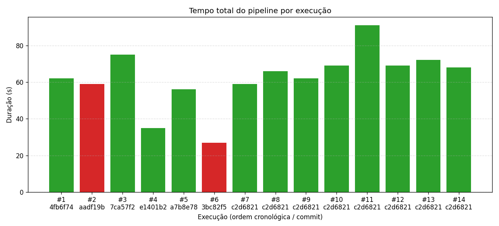
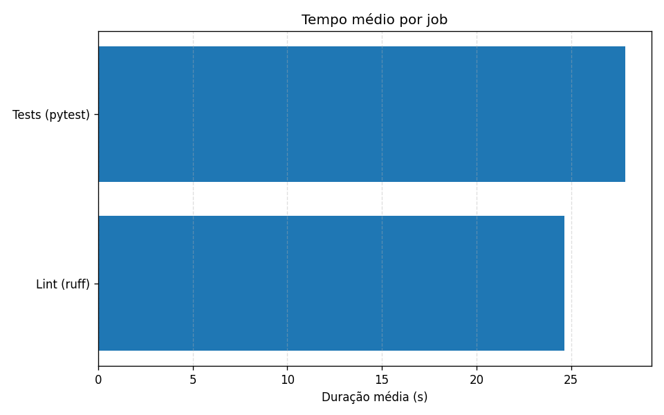
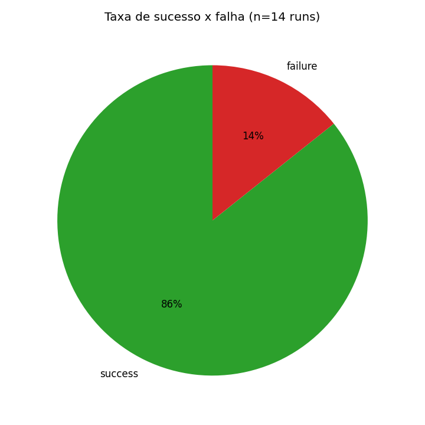
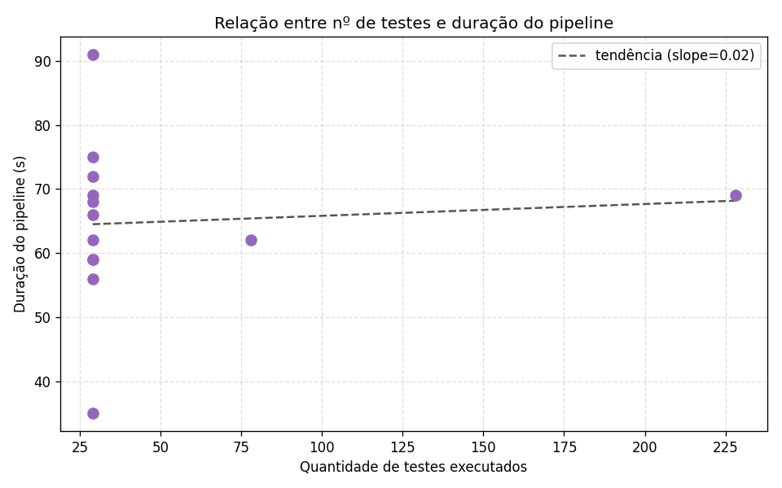

# Relatório Técnico — Experimento de Métricas de Pipeline CI/CD

> **Como usar este template:** preencha todos os blocos marcados com `‹...›` com os
> dados REAIS do seu experimento. Blocos com evidências reais (IDs de run, commits,
> prints) são **obrigatórios** — relatórios sem evidência real não serão aceitos.

- **Aluno:** ‹seu nome›
- **Repositório:** ‹https://github.com/SEU_USUARIO/ponderada-ci-cd›
- **Workflow (YAML):** [.github/workflows/ci.yml](../.github/workflows/ci.yml) — ‹link no GitHub›
- **Data do experimento:** ‹AAAA-MM-DD›

---

## 1. Introdução e objetivo

Este experimento mede e analisa o comportamento de um pipeline CI/CD a partir de
execuções reais no GitHub Actions. O objetivo é coletar métricas de desempenho,
estabilidade e gargalos, gerar gráficos e produzir uma análise crítica.

O projeto-base é uma **TODO API em FastAPI** com testes automatizados (unitários e
de integração), usada apenas como veículo para variar as execuções do pipeline.

## 2. Setup do experimento

- **Pipeline:** jobs `Lint (ruff)` e `Tests (pytest)`. Cada job: checkout → setup
  Python (com/sem cache) → instalar dependências → lint/testes → artefato (`reports/`).
- **Artefato:** `junit.xml` (+ `coverage.xml` e `test-summary.json`), usado para extrair
  contagem de testes, falhas e tempo médio.
- **Coleta:** `scripts/collect_metrics.py` combina a **API REST do GitHub**
  (durações de run/job/step, status, commit) com o **parse do JUnit XML**.
- **Visualização:** `scripts/plot_metrics.py` (pandas + matplotlib).
- **Reprodução:** ver [README.md](../README.md).

### Hipóteses iniciais (definidas ANTES de rodar)

| # | Hipótese |
|---|----------|
| H1 | A etapa de **instalação de dependências** será o maior gargalo de tempo. |
| H2 | O **cache** reduzirá o tempo de instalação em runs subsequentes. |
| H3 | Rodar `lint` e `test` em **paralelo** reduzirá o tempo total do pipeline. |
| H4 | Aumentar o **nº de testes** aumentará a duração do pipeline de forma ~linear. |
| H5 | ‹sua hipótese adicional› |

## 3. Metodologia — variações executadas

Cada execução abaixo corresponde a um commit/disparo real. **Preencha com os dados reais.**

| # | Variação aplicada | Commit (sha real) | Run ID real | Conclusão | Obs. |
|---|-------------------|-------------------|-------------|-----------|------|
| 1 | Baseline (verde) | ‹sha› | ‹run_id› | ‹success› | |
| 2 | Baseline repetido (variância) | ‹sha› | ‹run_id› | ‹success› | |
| 3 | Teste falhando | ‹sha› | ‹run_id› | ‹failure› | |
| 4 | Correção do teste | ‹sha› | ‹run_id› | ‹success› | tentativas até verde |
| 5 | +50 testes (`bulk_tests=50`) | ‹sha› | ‹run_id› | ‹success› | |
| 6 | +200 testes (`bulk_tests=200`) | ‹sha› | ‹run_id› | ‹success› | |
| 7 | Teste lento (`slow_test_seconds=20`) | ‹sha› | ‹run_id› | ‹success› | |
| 8 | Remoção do teste lento | ‹sha› | ‹run_id› | ‹success› | |
| 9 | Sem cache (`use_cache=false`) | ‹sha› | ‹run_id› | ‹success› | |
| 10 | Cache frio (1ª run, popula) | ‹sha› | ‹run_id› | ‹success› | |
| 11 | Cache quente (cache hit) | ‹sha› | ‹run_id› | ‹success› | |
| 12 | Jobs paralelos (remove `needs`) | ‹sha› | ‹run_id› | ‹success› | |
| 13 | Jobs sequenciais (`needs: lint`) | ‹sha› | ‹run_id› | ‹success› | |
| 14 | Falha de lint | ‹sha› | ‹run_id› | ‹failure› | |

> Total de execuções: **‹N› (≥12)**.

## 4. Evidências reais de execução

- **Lista de runs (Actions):** ‹link›
- **IDs reais dos workflows:** ‹run_ids›
- **Prints:** (coloque imagens em `docs/prints/`)

‹adicione mais prints: uma run verde, uma run vermelha, detalhe de timing de job, etc.›

## 5. Gráficos

Gerados a partir de `data/metrics.csv` por `scripts/plot_metrics.py`.

| Tempo total por execução | Tempo médio por job |
|---|---|
|  |  |

| Sucesso x falha | Nº de testes x duração |
|---|---|
|  |  |

## 6. Análise (perguntas obrigatórias)

1. **Qual etapa mais contribuiu para o tempo total do pipeline?** ‹...›
2. **Houve diferença significativa entre execuções com e sem cache?** ‹compare o step "Install dependencies" das runs 9/10/11›
3. **O paralelismo reduziu o tempo total? Em que condições?** ‹compare runs 12 vs 13›
4. **Quais falhas foram mais frequentes?** ‹teste vs lint; ver coluna conclusion›
5. **O pipeline fornece feedback rápido o suficiente para o desenvolvedor?** ‹...›
6. **Que melhorias poderiam ser feitas no pipeline?** ‹...›
7. **Quais limitações existem nos dados coletados?** ‹...›
8. **Como essa análise poderia apoiar decisões de engenharia?** ‹...›

## 7. Resultados inesperados (mínimo 2)

- **Resultado inesperado 1:** ‹descreva o observado, por que surpreendeu e a provável causa›
- **Resultado inesperado 2:** ‹...›

## 8. Hipótese inicial vs. resultado observado

| Hipótese | Resultado observado | Confirmada? |
|----------|---------------------|-------------|
| H1 (install = gargalo) | ‹...› | ‹sim/não› |
| H2 (cache acelera) | ‹...› | ‹sim/não› |
| H3 (paralelo acelera) | ‹...› | ‹sim/não› |
| H4 (mais testes = mais tempo) | ‹...› | ‹sim/não› |
| H5 ‹...› | ‹...› | ‹...› |

## 9. Limitações do experimento

- Variância natural dos runners hospedados do GitHub (mesmo código → durações distintas).
- `workflow_duration` (`updated_at − run_started_at`) pode incluir tempo de fila.
- Ganho de cache só aparece a partir da 2ª run com cache (a 1ª popula o cache).
- Amostra pequena (‹N› runs) — tendências são indicativas, não estatisticamente robustas.
- ‹outras limitações que você observou›

## 10. Conclusão

‹síntese: principais gargalos, o que funcionou, o que você recomendaria mudar›
